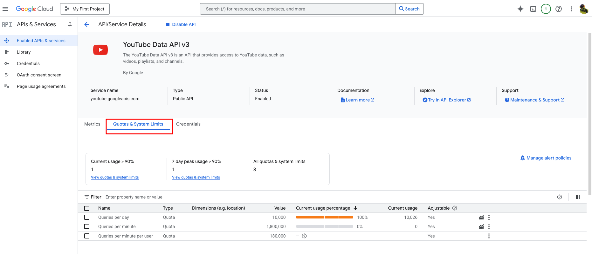

# YouTube Subscription Migrator

This project allows you to migrate YouTube subscriptions from one account to another using a Java application with the YouTube Data API.

## Overview
- **ExportYouTubeSubscriptions.java**: Exports subscription IDs from the source YouTube account to a `subscriptions.txt` file.
- **ImportYouTubeSubscriptions.java**: Imports subscriptions into the target YouTube account, respecting the 60 subscriptions per day limit.

## Prerequisites
- Java Development Kit (JDK) 8 or higher.
- Maven for dependency management.
- Google Cloud Console account with YouTube Data API enabled.

## Setup Instructions

### 1. Configure Google Cloud Project
1. Go to [Google Cloud Console](https://console.cloud.google.com).
2. Create a new project (e.g., "YouTube Subscription Transfer").
3. Enable the YouTube Data API:
   - Navigate to "APIs & Services" → "Library" → "YouTube Data API v3" → "Enable".
4. Set up OAuth Consent Screen:
   - Go to "OAuth consent screen".
   - Select "External".
   - Fill in required fields (App name: "YouTube Subscription Transfer", support email, developer email).
   - Add scopes:
      - `https://www.googleapis.com/auth/youtube.readonly` (for export).
      - `https://www.googleapis.com/auth/youtube` (for import).
   - In "Test users", add the emails of the source and target accounts.
   - Save changes and leave the app in "Testing" status.
5. Create OAuth 2.0 Client ID:
   - Go to "Credentials" → "Create Credentials" → "OAuth 2.0 Client IDs".
   - Choose "Desktop app", name it (e.g., "Desktop client 1"), and create.
   - Download `client_secrets.json` and save it in the project root (or use the name specified in `config.properties`).

### 2. Prepare the Project
- Ensure `pom.xml` contains the necessary dependencies.
- Create a `config.properties` file in the project root with:
- - Place your `client_secrets.json` file in the project root (or match the name specified in `config.properties`).

### 3. Export Subscriptions
1. Run `ExportYouTubeSubscriptions.java` in your IDE.
2. In the browser:
- Log in with the source account.
- Grant access ("View your YouTube account").
3. Check `subscriptions.txt` for exported channel IDs.

### 4. Import Subscriptions
1. Run `ImportYouTubeSubscriptions.java` in your IDE.
2. In the browser:
- Log in with the target account (use incognito mode or log out of the source account).
- Grant access ("Manage your YouTube account").
3. Monitor the console:
- The program tracks the 95 subscriptions/day limit and stops if exceeded, saving progress in `subscription_count.txt`.
- Repeat the next day if needed.

### 5. Verify Results
- Log in to the target account on YouTube.
- Check "Subscriptions" to confirm migrated channels.
- Review the console for any errors.

## Best Practices
- Use a 5-second delay between requests to avoid rate limits.
- Monitor quotas in Google Cloud Console → "Quotas".
- Backup `subscriptions.txt` for future use.
- Prefer personal (@gmail.com) accounts to avoid G Suite restrictions.

## Known Issues and Solutions
- **403 Error**: Ensure scopes are added and both account emails are in "Test users".
- **Rate Limits**: The program enforces the 95 subscriptions/day limit.

## Where to Check Limits
- To monitor your API quotas, go to [Google Cloud Console](https://console.cloud.google.com), navigate to "APIs & Services" → "Quotas", and select "YouTube Data API v3". The "Quotas & System Limits" section will show your current usage (e.g., 10,000 queries per day) and percentage used.

## Additional Resources
- For more details, visit the [YouTube Subscription Migrator Wiki](https://deepwiki.com/yuriiormson/YouTube-Subscription-Migrator), which provides comprehensive documentation, troubleshooting guides, and additional resources related to this project, maintained by the developer to support users and contributors.

## License
[MIT License](LICENSE)

## Contributions
Feel free to fork and submit pull requests!